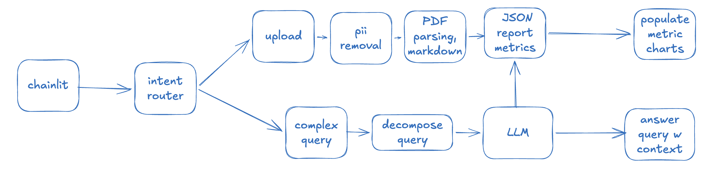
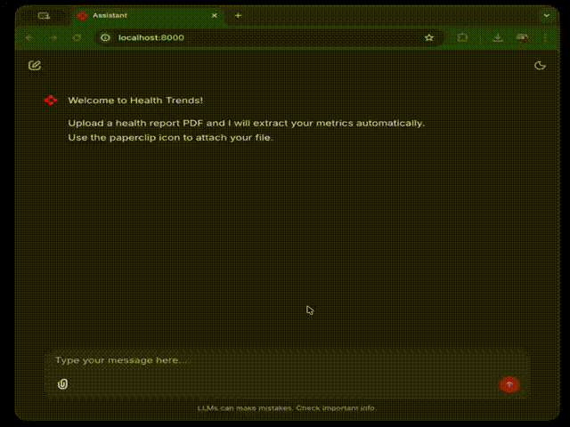
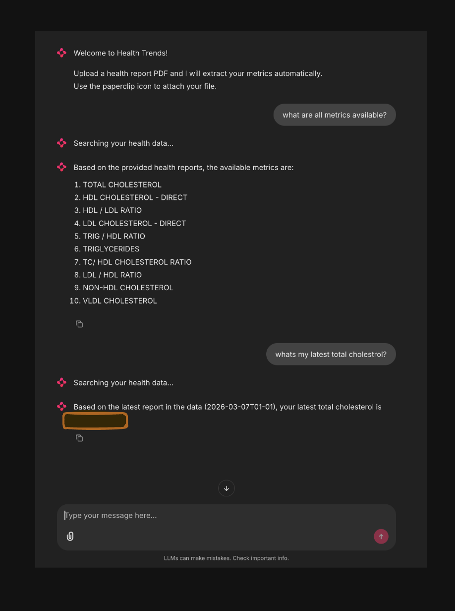
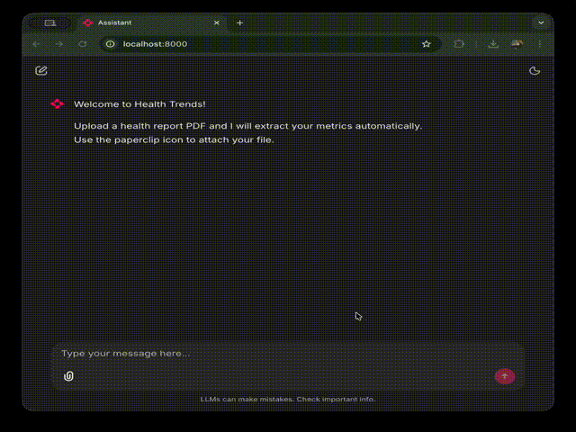
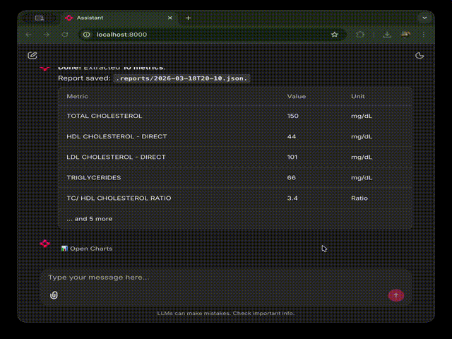

# Health Data Query Interface

## Overview
I built this sytem to track my health metrics over time.

<!--  -->

## How It Works

<!--  -->

- Ingestion Pipeline
  - Upload PDF (sample health report)
  - LLM extracts and saves metric to local JSON file
- Query Pipeline
  - queries get routed to LLM
  - LLM reads local JSON data to answer questions
- Charting Pipeline
  - Consecutive health reports are mapped to metric names
  - If values are different for same metric, trend chart is plotted 
# Demo

## Ingestion Pipeline

## Query Pipeline

## Charts

## Example Queries
- "What is my latest LDL?"
- "How has my cholesterol changed over the last 3 months?"
- "Is my HDL within reference range?"

