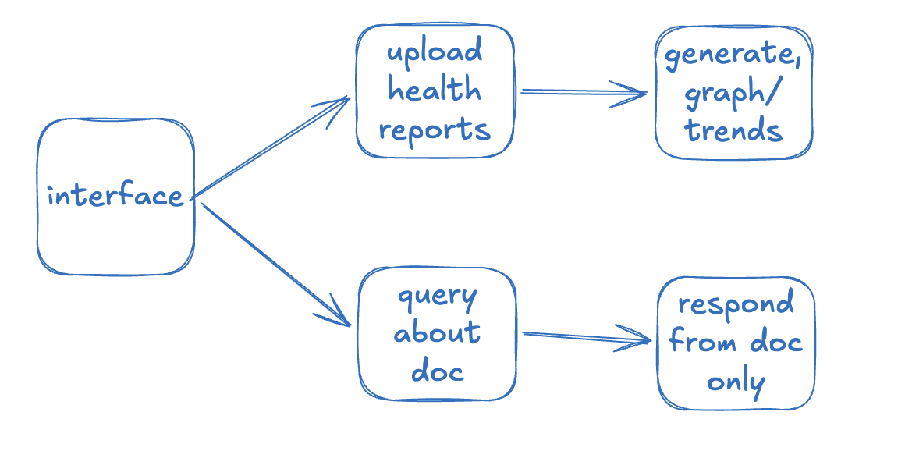
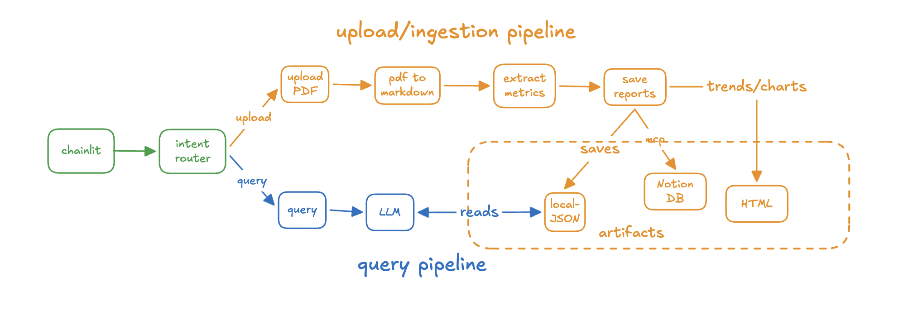
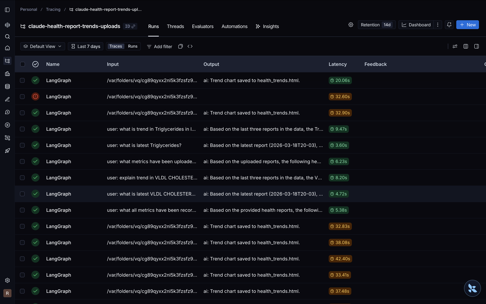
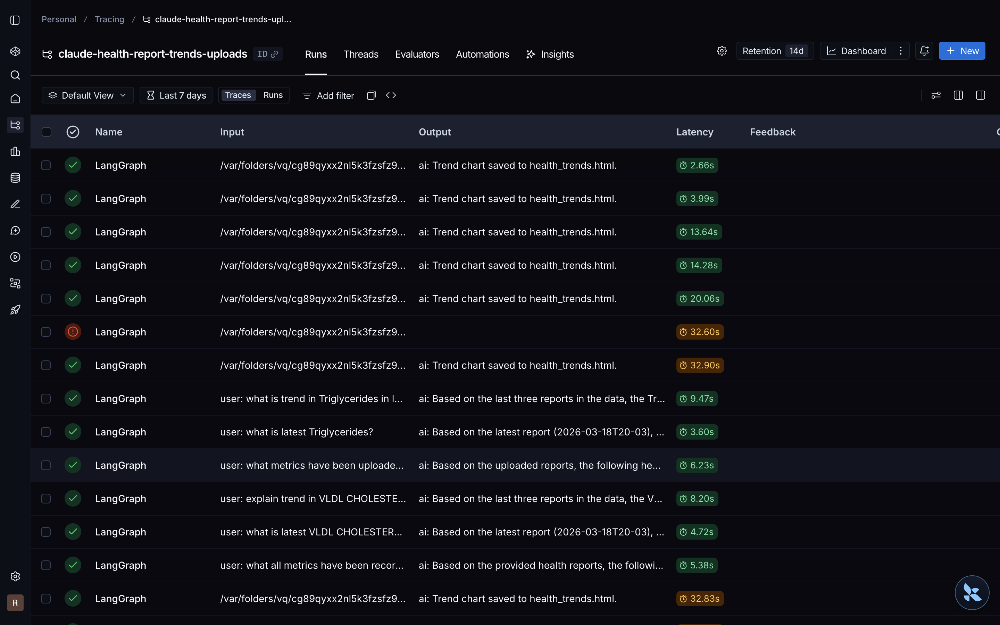
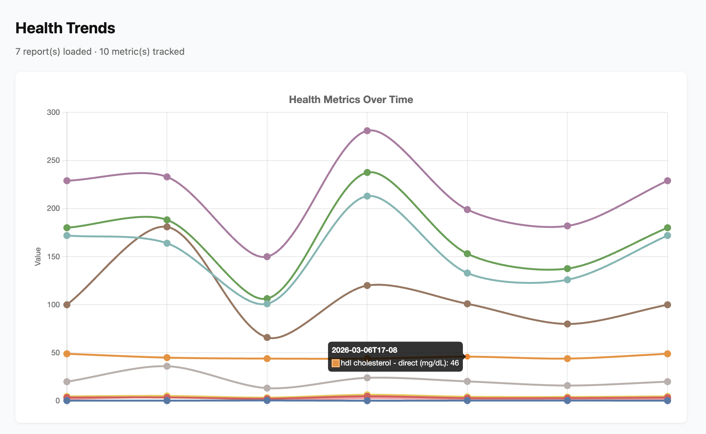

# Health Metrics Tracker 📈

**Your health data, finally making sense over time.**

Got stacks of blood test PDFs sitting in a folder somewhere? Health Metrics Tracker lets you upload your lab reports, automatically extracts the numbers, and shows you how your metrics have changed — so you can actually see trends, not just isolated snapshots.

## What It Does

- 📄 **Upload Reports** → Drop in a PDF health report (blood tests, labs, etc.)
- 🤖 **AI Extraction** → Automatically pulls out test names, values, units, and reference ranges
- 📊 **Visualise Trends** → See how your metrics change across multiple reports over time
- 💬 **Ask Questions** → Query your data in plain English — *"What's my latest LDL?"* or *"How has my glucose changed?"*
- 🔒 **Privacy First** → Runs locally, PII is stripped before processing

## Key Features

### Automated Report Processing
- **PDF Ingestion**: Upload any standard lab report PDF
- **Smart Parsing**: Handles unstructured text, tables, and mixed formatting
- **PII Removal**: Personal identifiers stripped before data is processed
- **Structured Extraction**: AI converts raw report text into clean, queryable JSON

### Health Trend Visualisation
- **Multi-Report Tracking**: Upload reports over time and watch your metrics evolve
- **Interactive Charts**: HTML chart auto-generated after each upload
- **Date-Aware**: Collection dates parsed and displayed clearly on the timeline

### Natural Language Querying
- **Plain English Questions**: Ask about any metric across all your uploaded reports
- **Context-Aware Answers**: AI answers using only your actual data

### Performance & Cost
- **Small, Fast Models**: Uses DeepSeek and Groq-hosted models — not heavyweight proprietary APIs
- **Optimised Latency**: P50 latency reduced from ~20s to under 3s
- **Token Efficiency**: Prompts tuned to minimise API spend

## 🛠 Technology Stack

**UI**: Chainlit
**Backend**: LangGraph (multi-node pipeline)
**Storage**: Qdrant vector database
**AI Models**: DeepSeek (via LiteLLM), Groq (fast intent classification)
**Document Parsing**: Docling
**Observability**: LangSmith

## 🐦 Bird's Eye View





Demo GIFs attached below 👇 ...

## 🚀 Quick Setup

### Prerequisites

- Python 3.11+
- `uv` package manager
- A free [Qdrant](https://cloud.qdrant.io/) cluster
- API keys for DeepSeek and Groq

### Local Setup

1. **Clone the repo**
   ```bash
   git clone <your-repo-url>
   cd query-health-report-copy
   ```

2. **Set up environment**
   ```bash
   cp .env.example .env
   # Fill in your API keys and Qdrant cluster URL
   ```

3. **Install dependencies**
   ```bash
   uv sync
   ```

4. **Run the app**
   ```bash
   make run-ui
   ```
   Opens the Chainlit interface at `http://localhost:8000`

## 💡 How to Use

1. Open the Chainlit UI
2. Upload a PDF health report using the paperclip icon
3. Wait for extraction — a summary table of metrics will appear
4. Upload more reports over time to build up your trend history
5. Open `health_trends.html` in your browser to view charts
6. Ask questions like:
   - *"What is my latest cholesterol?"*
   - *"How has my haemoglobin changed over the last 6 months?"*

> **Tip**: Start with single-page documents for faster processing on first use.

## 📁 Project Structure

```
src/
  config/       # Environment variables and constants
  graph/        # LangGraph pipeline and state definitions
  nodes/        # Individual processing nodes (upload, parse, extract, etc.)
  utils/        # Shared utilities (date formatting, intent classification)

main.py         # CLI entry point
chainlit_app.py # Web UI entry point
```

## 📊 Observability & Cost Control

- **LangSmith**: Full LangGraph flow tracing for debugging and performance monitoring
- **Qdrant Tuning**: Custom `ef` search parameters and ingestion configs — not relying on defaults
- **Latency**: Optimised upload pipeline from ~32s down to ~3s (**91% reduction**)

## ⚡ Latency Optimisations

Three targeted changes reduced end-to-end upload latency from **32–42s → 2.6–3.9s**:

| Optimisation | Before | After | Saving |
|---|---|---|---|
| Disabled OCR in Docling (digital PDFs don't need it) | ~20s | ~2s | ~90% |
| Singleton `DocumentConverter` (load models once, not per upload) | reloads every run | cached | eliminates repeated init |
| Switched JSON extraction from DeepSeek → Groq (`llama-3.3-70b-versatile`) | ~12s | ~1s | ~92% |

**Overall upload latency: 32–42s → 2.6–3.9s (~91% faster)**

#### Before Optimisation


#### After Optimisation


## Demo

#### Uploading a Health Report


#### Querying Your Reports


#### Health Trends Chart


## 📄 License

All Rights Reserved.
