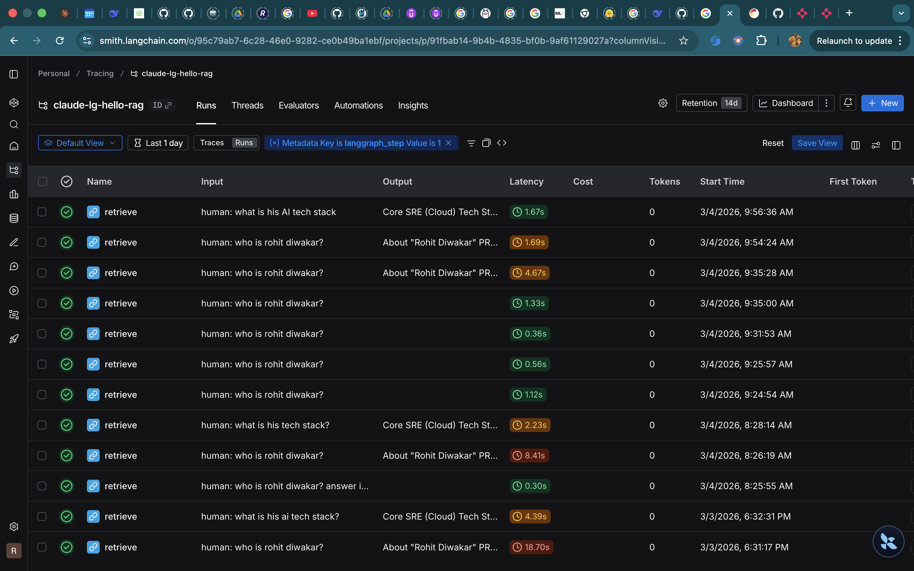
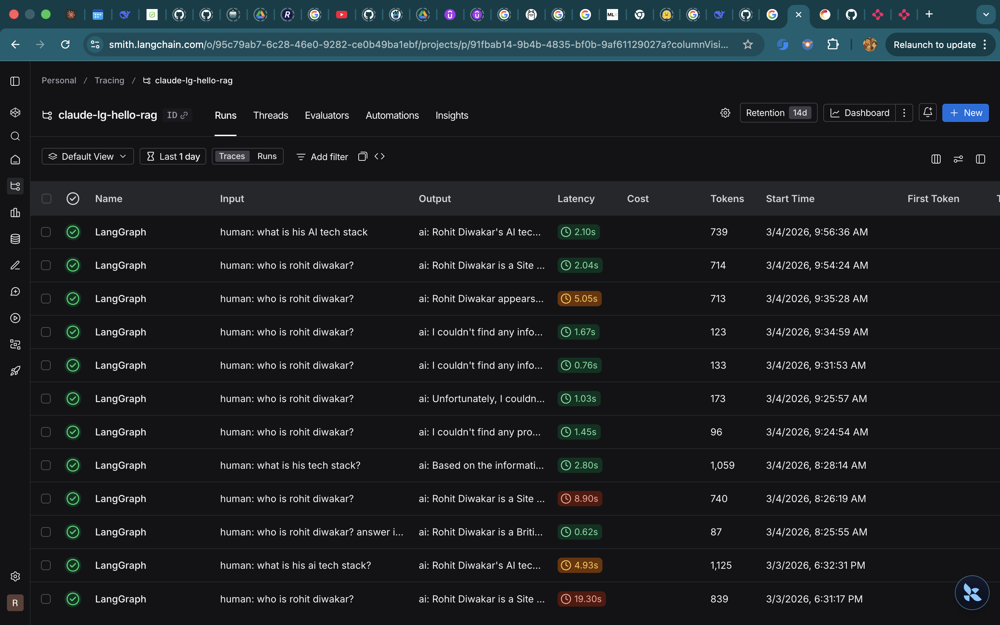

## Health Metrics Tracker
This simple solution is to help track health metrics over time.

## Considerations
- simple document ingestion, embedding and extraction
- special consideration for unstructured tabular data
- pii removal
- minimise token spends and costs
- privacy

## Features
- Upload health reports over time to visualise trends
- Upload health docment H1 to parse information and generate initial graph (points only will be shown on first upload)
- Upload another document H2. This updates embeddings and charts to show trends.
- Query over health report metrics Eg, what is my latest LDL? how has my glucose changed over last 3 months?

## Architecture
Simple 3 tier architecture 
- LangGraph backend (multi node based, uses small SLMs for speicifc tasks)
- fronted by Chainlit
- Persistence by Qdrant
- Cost, Performance considerations
  - used smaller SLMs
  - used faster inferncing by Groq
  - used open source models (deepseek) over heavy propriety models (OpenAI, Anthropic)
- Built initial MVP using Claude Code

## How To Run/ Demo
- clone repo
- update `.env` from `.env.example`
- setup free qdrant cluster and note cluster URL in `.env`
- Setup, activate venv env
- goto Makefile for commands
  - `make run-ui` sets up backend and opens chainlit interface
- in chainlit, upload document in PDF
- ask questions about report
- Open health_trends.html in root to see charts/ trends

# Demo
#### Trends

#### Query Report

### Optimisations
Initial Latency

Latency, Tokens Control

Latency, Tokens Control

#### Claude Code CLI Token, Cost Tracking

## Note for first time usage
- upload single page documents first for faster processing.

## Observability, Cost Control
- Optimised by setting up specific configs in Qdrant during ingestion and retrieval (SearchParam Tuning (ef-param), ignoring defaults
- LangGraph flow on LangSmith for debugging, troubleshooting.
- Claude Code CLI on LangSmith using stop-hooks and config files for token, cost usage.
- Reduced average P50 latency to less than 3s from ~20secs.